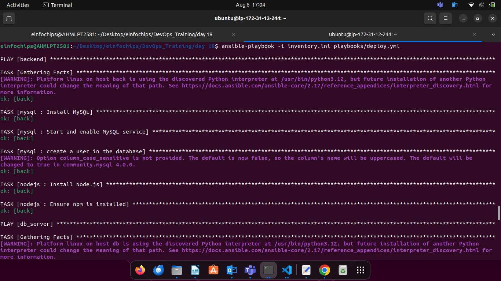
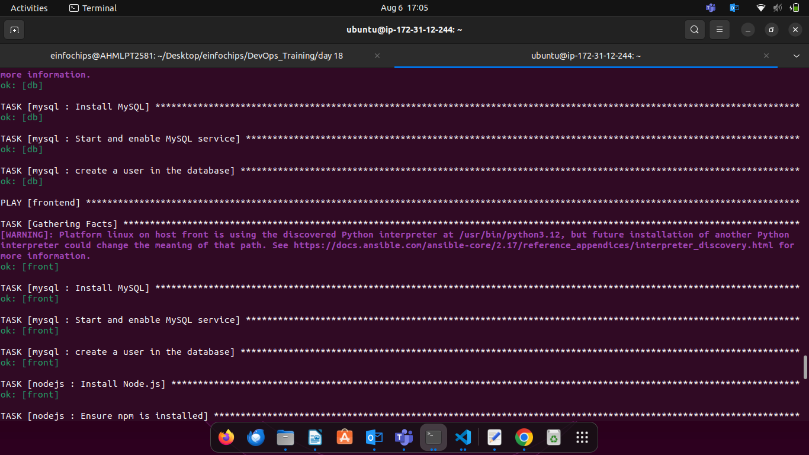
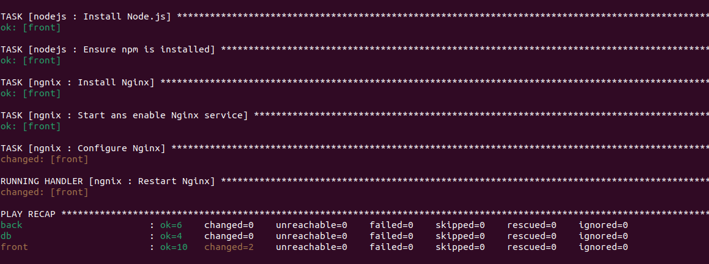

# Project 01

#### Problem Statement

You are tasked with deploying a three-tier web application (frontend,
backend, and database) using Ansible roles. The frontend is an Nginx web
server, the backend is a Node.js application, and the database is a
MySQL server. Your solution should use Ansible Galaxy roles where
applicable and define appropriate role dependencies. The deployment
should be automated to ensure that all components are configured
correctly and can communicate with each other.

#### Steps and Deliverables

1.  Define Project Structure

    -   Create a new Ansible project with a suitable directory structure
        to organize roles, playbooks, and inventory files.
```
├── inventory.ini
├── playbooks
│   ├── back-deploy.yml
│   ├── data-deploy.yml
│   └── front-deploy.yml
└── roles
    ├── mysql
    │   ├── defaults
    │   │   └── main.yml
    │   ├── files
    │   ├── handlers
    │   │   └── main.yml
    │   ├── meta
    │   │   └── main.yml
    │   ├── README.md
    │   ├── tasks
    │   │   └── main.yml
    │   ├── templates
    │   ├── tests
    │   │   ├── inventory
    │   │   └── test.yml
    │   └── vars
    │       └── main.yml
    ├── ngnix
    │   ├── defaults
    │   │   └── main.yml
    │   ├── files
    │   ├── handlers
    │   │   └── main.yml
    │   ├── meta
    │   │   └── main.yml
    │   ├── README.md
    │   ├── tasks
    │   │   └── main.yml
    │   ├── templates
    │   ├── tests
    │   │   ├── inventory
    │   │   └── test.yml
    │   └── vars
    │       └── main.yml
    └── nodejs
        ├── defaults
        │   └── main.yml
        ├── files
        ├── handlers
        │   └── main.yml
        ├── meta
        │   └── main.yml
        ├── README.md
        ├── tasks
        │   └── main.yml
        ├── templates
        ├── tests
        │   ├── inventory
        │   └── test.yml
        └── vars
            └── main.yml
```

2.  Role Selection and Creation

    -   Select appropriate roles from Ansible Galaxy for each tier of
        the application:

    - Nginx for the frontend.

        ```
        ansible-galaxy init roles/ngnix
        ```

    - Node.js for the backend.

        ```
        ansible-galaxy init roles/nodejs
        ```

    -   MySQL for the database.
        ```
        ansible-galaxy init roles/mysql
        ```

        

3.  Dependencies Management

    -   Define dependencies for each role in the meta/main.yml file.
    -   Ensure that the roles have appropriate dependencies, such as
        ensuring the database is set up before deploying the backend.

        + nodejs/meta/main.yml
        ```
        dependencies: 
        - role: mysql
            when: ansible_os_family == "Debian"
        ```

4.  Inventory Configuration

    -   Create an inventory file that defines the groups of hosts for
        each tier (frontend, backend, database).
    -   Ensure proper group definitions and host variables as needed.

    inventory.ini
    ```ini
    [frontend] 
    front ansible_host=18.***.***.22* ansible_user=ubuntu ansible_ssh_private_key_file=/home/einfochips/.ssh/ansible-worker.pem

    [backend] 
    back ansible_host=18.***.***.22* ansible_user=ubuntu ansible_ssh_private_key_file=/home/einfochips/.ssh/ansible-worker.pem

    [db_server] 
    db ansible_host=18.***.***.22* ansible_user=ubuntu ansible_ssh_private_key_file=/home/einfochips/.ssh/ansible-worker.pem
    ```


5.  Playbook Creation

    -   Create a playbook (deploy.yml) that includes and orchestrates
        the roles for deploying the application.
    -   Ensure the playbook handles the deployment order and variable
        passing between roles.

    #### playbooks/deploy.yml
    ```yml
    ---
    - hosts: frontend
      become: yes
      roles: 
        - ngnix

    - hosts: db_server
      become: yes
      roles: 
        - mysql

    - hosts: backend
      become: yes
      roles: 
        - nodejs
    ```

6.  Role Customization and Variable Definition

    -   Customize the roles by defining the necessary variables in
        group\_vars or host\_vars as needed for the environment.
    -   Ensure sensitive data like database credentials are managed
        securely.

        ### nginx

        + Task/main.yml

        ```yml
        ---
        - name: Install Nginx 
          apt:
            name: nginx
            state: present
          become: yes
        
        - name: Start ans enable Nginx service
          service:
            name: nginx
            state: started
            enabled: true
          become: yes
        
        - name: Configure Nginx
          template:
            src: index.html.j2
            dest: /var/www/html/index.html
          notify: Restart Nginx
        ```

        + handlers/main.yml 
        ```yml
        ---
        - name: Restart Nginx
          systemd:
            name: nginx
            state: restarted
        ```
        
        + files/index.html
        ```html
        <html>
            <head>
                <title>Day-18</title>
            </head>
            <body>
                <center>
                    <h1>Hello from Frontend</h1>
                </center>
            </body>
        </html>
        ```

        + templates/index.html.j2
        ```html
        <html>
            <head>
                <title>Day-18</title>
            </head>
            <body>
                <center>
                    <h1>Hello from Frontend</h1>
                </center>
            </body>
        </html>
        ```

        ### mysql

        + Task/main.yml

        ```yml
        ---
        - name: Install MySQL
          apt:
            update_cache: yes
            name: ['mysql-server','mysql-client','python3-mysqldb','libmysqlclient-dev']
            state: present
          become: yes

        - name: Start and enable MySQL service
          service:
            name: mysql
            state: started
            enabled: true
          become: yes

        - name: create a user in the database
          mysql_user:
            name: "{{mysql_user}}"
            password: "{{mysql_password}}"
            priv: '*.*:ALL'
            host: '%'
            sate: present
            become: yes 
        ```

        ### nodejs

        + Task/main.yml

        ```yml
        ---
        - name: Install Node.js 
          apt:
            name: nodejs
            state: present
            update_cache: yes

        - name: Ensure npm is installed 
          apt:
            name: npm
            state: present
        ```
  Run the file deploy.yml
  ```
  ansible-playbook -i inventory.ini playbooks/deploy.yml
  ```
  

  

  

  Final Output to check the index.html file
  

7.  Testing and Validation

    -   Create a separate playbook for testing the deployment (test.yml)
        that verifies each tier is functioning correctly and can
        communicate with the other tiers.
    -   Use Ansible modules and tasks to check the status of services
        and applications.
